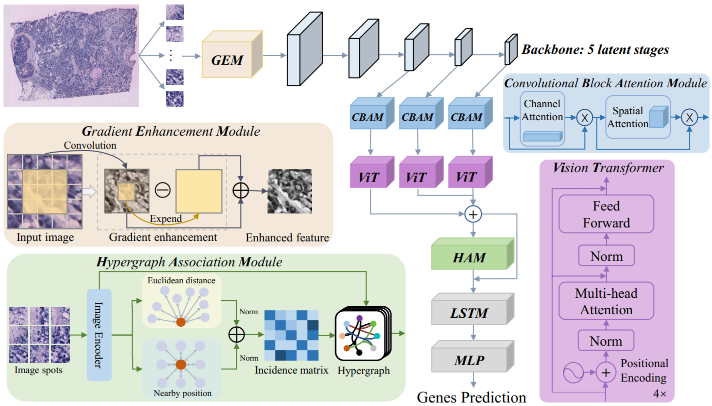

# Gene Expression Prediction from Histology Images via Hypergraph Neural Networks
### 

Spatial transcriptomics reveals the spatial distribution of genes in complex tissues, providing crucial insights into biological processes, disease mechanisms, and drug development. The prediction of gene expression based on cost-effective histology images is a promising yet challenging field of research. Existing methods for gene prediction from histology images exhibit two major limitations. First, they ignore the intricate relationship between cell morphological information and gene expression. Second, these methods do not fully utilize the different latent stages of features extracted from the images. To address these limitations, this paper proposes a novel hypergraph neural network model, HGGEP, to predict gene expressions from histology images. HGGEP includes a gradient enhancement module to enhance the model’s perception of cell morphological information. A lightweight backbone network extracts multiple latent stage features from the image, followed by attention mechanisms to refine the representation of features at each latent stage and capture their relations with nearby features. To explore higher-order associations among multiple latent stage features, we stack them and feed into the hypergraph to establish associations among features at different scales. Experimental results on multiple datasets from disease samples including cancers and tumor disease, demonstrate the superior performance of our HGGEP model than existing methods.
       

## System environment
Required package:
- PyTorch >= 1.10
- pytorch-lightning >= 1.4
- scanpy >= 1.8
- python >= 3.7
- torch_geometric

# HGGEP pipeline

See [tutorial.ipynb](tutorial.ipynb)

NOTE: Run the following command if you want to run the script tutorial.ipynb
 
1.  Please run the script `download.sh` in the folder [data](https://github.com/biomed-AI/Hist2ST/tree/main/data) 

or 

Run the command line `git clone https://github.com/almaan/her2st.git` in the dir [data](https://github.com/biomed-AI/Hist2ST/tree/main/data) 

2. Run `gunzip *.gz` in the dir `HGGEP/data/her2st/data/ST-cnts/` to unzip the gz files

# Datasets

 -  human HER2-positive breast tumor ST data https://github.com/almaan/her2st/.
 -  human cutaneous squamous cell carcinoma 10x Visium data (GSE144240).

# Train models

Trained models of Hist2ST on HER2+ and cSCC datasets can be found at [synapse](https://www.synapse.org/#!Synapse:syn29738084/files/)

